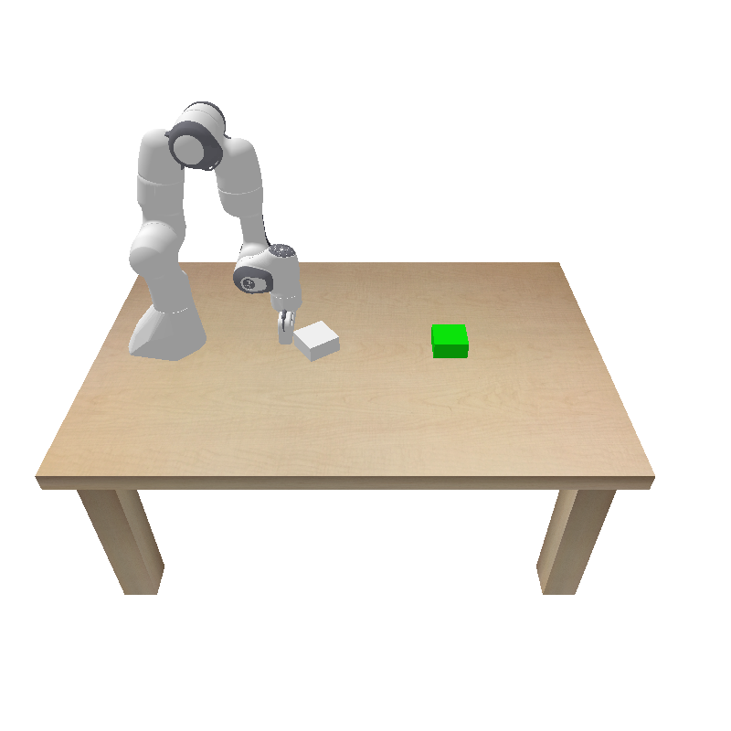
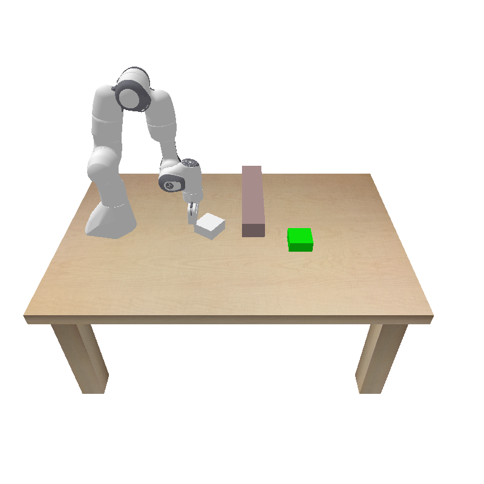
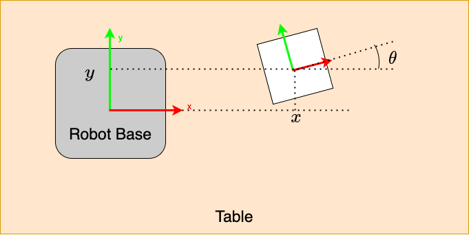
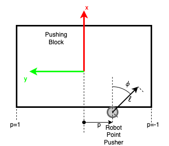

# NeuralODE Based Dynamics Learning for Planar Pushing

ROB 498/599 (WN25) Robot Learning final project.

This repo studies **learning state dynamics** for a **planar pushing** task in PyBullet using a **Neural ODE** model.  
We collect transition data from a Panda pushing environment and train NeuralODE-based dynamics models under both **single-step** and **multi-step** supervision, comparing different ODE solvers (e.g., Euler / RK4 / Dopri5) and training settings.  
See more details in "Final Report.pdf".

---

## 🎬 Demo
 
### Without obstacle:    
  

### With obstacle:  
  

---

## 🧠 Problem Setup

- **Environment:** Panda planar pushing (PyBullet)
- **State:** object pose in SE(2)  
    
- **Action:** pushing command  
    
  where:
  - `p ∈ [-1, 1]` is the (normalized) contact point along the object edge
  - `φ ∈ [-π/2, π/2]` is the push direction angle
  - `ℓ ∈ [0, 1]` scales the maximum push length (e.g., 0.1 m)

The environment is commonly treated under a **quasi-static** assumption (i.e., no explicit velocity/inertia modeling).

---

## 🚀 Project Overview

1. **Data Collection (Random Policy)**
   - Roll out the environment with random pushing actions.
   - Save trajectories as transition tuples `(state, action, next_state)`.

2. **Data Processing**
   - Build dataloaders for:
     - **Single-step** prediction: \( x_{t+1} \)
     - **Multi-step** rollout: \( x_{t+1:t+K} \) given \( u_{t:t+K-1} \)
   - Standard 80/20 train/val split.

3. **Neural ODE Dynamics Model**
   - Learn continuous-time dynamics:
     \[
     \dot{x} = f_\theta(x, u)
     \]
   - Use `torchdiffeq` to integrate forward and predict next state(s).
   - Compare ODE integrators (e.g., `euler`, `rk4`, `dopri5`) and learning rates.

4. **Evaluation**
   - Report train/val losses for:
     - single-step prediction
     - multi-step rollout over different horizons (`K`)
   - Save trained checkpoints per solver/config for reproducibility.

---
